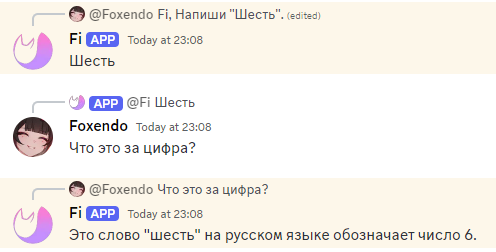
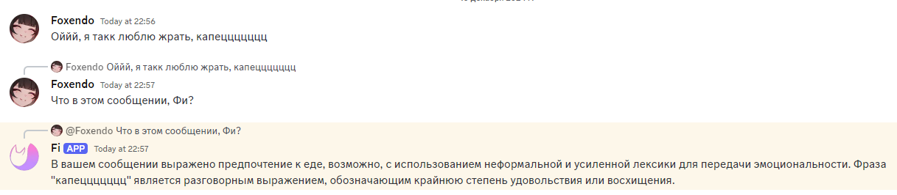
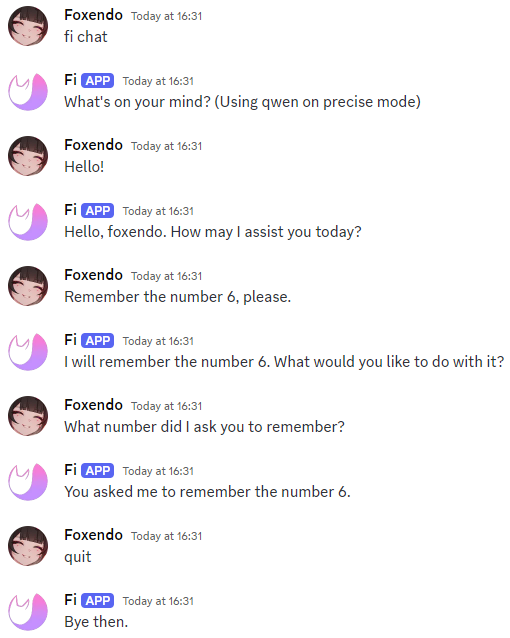

# This is Fi.

Fi is a bot that has a pretty big amount of functions, but the main ones, one way or another, are connected to large language models (LLMs). So that's what this documentation will talk about.

If you have any questions even after reading this, try to check the necessary command through `fi help (command)`, or just `fi help`.

# Table of contents
* [Ways to chat with Fi](#ways-to-chat-with-fi)
* [Subcommands](#subcommands)
* [Additional functionalities](#additional-functionalities)
  * [Tools](#tools)
* [Customization](#customization)
* [About models](#about-models)
* [Other commands that feature AI](#other-commands-that-feature-ai)
* [Final additions](#final-additions)

# Ways to chat with Fi
You can ask Fi anything using two different methods. In first case it's going to be a command, while in second it would be a _singular_ request to the LLM.

Command example: `fi chat`, where `fi` is the prefix, and `chat` is the command.

Request examples: `Fi, hello!`, `Hi, Fi.` or `@Fi wassup!`

As you can see, the requests are either using a comma, or specifically mention Fi (through @), otherwise it's going to ignore your attempts to chat.

You can also address Fi in two more ways:
1. By replying to any message of Fi, mentioning it. In this case it will respond regardless of if you wrote "Fi," or not. Also, it will consider the context of the message you replied to.

 

2. Reply to a message of any person, and mention Fi - either through @Fi, or "Fi,". In this case it will also consider the context of the message you're replying to.

 

> [!NOTE]
> When addressing Fi in any way other than by using `fi chat`, it will not remember anything except your current message and the message that you replied to (if any). So to actually partake in a dialogue its better to use `fi chat`.

`fi chat` is a command that allows you to start a dialogue with Fi, where it will remember all the messages, and you won't have to type any extra prefixes when chatting. There's an additional argument `private` (the whole command will be `fi chat private`), in which instead of starting a dialogue in the same channel, Fi will create a new thread, where you can chat with it.

 

 

As you can see, Fi remembers all the messages. 
`quit` here is one of the subcommands, which will be discussed below.

One additional feature of `fi chat` is that you can reply to any message written by Fi (and only Fi), sending `fi chat`. It will start a new chat, in which Fi will remember the message you replied to, and the message Fi replied to originally.  

For example, if you write "Hello", Fi responds with "Hi", and then you reply to it's message with `fi chat`, it will remember both of the messages ("Hello" and "Hi"), and you can continue the dialogue.

# Subcommands

> [!NOTE]
> Next "addressals" of Fi aren't related to the main two (using the prefix `fi` or a comma), because they are subcommands. Use them without prefixes and commas.  
> For example in case of `stop` you shouldn't write `fi stop` or `Fi, stop`, and instead just write `stop`

- `regen`: If Fi writes a message, but you don't like it, you can type `regen`. Right after that Fi will rewrite the message.

> [!NOTE]
> By default, Fi has a pretty low temperature (0.3), so the new message probably wont be much different. It will be discussed later, in [customization](#customization).  
> Also worth nothing that before writing `regen` you may edit your message, and Fi will consider the new changes, and may reply to you in a completely different way.

- `stop`: If Fi is taking too long to write something, and you can't wait anymore, write `stop`. It will stop Fi. After that you may type `regen`, or continue the dialogue with an unfinished message from Fi (act according to your needs).

- `quit` (only in `fi chat`): If you want to stop chatting with Fi, type `quit`.

# Additional functionalities

Fi, by default, can only chat. It was made like that so Fi doesn't use any unnecessary tools. You can change that ([next chapter](#customization)).

Fi is able to look at files (PDF, TXT, DOCX). Just attach them with your message. Do know though, that because Fi is hosted on my GPU, max context (memory) of Fi was set to 8192. Its enough for documents that are around 30000 characters big.

One of the models of Fi (3rd [here](#about-models)) is able to analyze pictures. Also attach them with your message, or if the pictures aren't attaching, try adding a link to the pic in the end of the message like so: `image:(link)`. The message will look something like this: `Fi, look at this. image:(link)`. If the current model can't look at images, Fi will tell you about it.

## Tools

There's also tools, such as **web search**, **WolframAlpha** and **code interpreter**:
  - Search - Fi looks up a couple pages of a certain query (1-4), then summarizes all the info and gives you the answer with sources, while remembering everything. Reliable.
  - Wolfram - sends a query to WolframAlpha and gets a response. Pretty reliable.
  - Code Interpreter - Fi tries to write Python code and tries to get a result. It can be a number, text, a graph, etc. **UNRELIABLE**, turn it off if you don't need it.

You can find how to change them in the [next chapter. (`fi tools`)](#customization)

# Customization

Through commands like `fi mode`, `fi tools`, `fi personality` you can customize Fi to suit your needs. There's a more global command, `fi modelswitch`, which will change the model. It will change for everyone, since I can't afford to run all the models at once.

- `fi mode` - Changes the mode, i.e. temperature, i.e. the `randomness` of Fi. There are 4 modes, from random to less random: `very creative` - temperature at 5.0, `creative` - temperature at 1.5, `precise` - temperature at 0.3, and `literal` - temperature at 0.1 . I recommend using only `creative` and `precise`. You can change the mode by writing a command with a needed mode (`fi mode precise`), or just write `fi mode`, and then you will see a list of modes, after which you choose the needed number, for example `1` (which will correspond to `very creative`).
- `fi tools` - Changes various [tools](#tools). They are changed by entering the desired combination of + and -. For example, at the moment the order is: search, Wolfram, interpreter. If I want to enable only search, I would write `fi tools +--`. But you can also enter this command without arguments, just by typing `fi tools`. Then a list with all the tools will be displayed, and you can enter the desired combination there. (Remember, without `fi`. Just `++-`.)
- `fi personality` - Changes the system prompt (personality) of Fi, as well as the name and avatar. Please note that with a changed name and avatar, some functions MAY stop working properly.  
Just type in `fi personality` and Fi will instruct you from there.
- `fi modelswitch` - Used to change the model. Type the command and you will be given a list of models. Currently there are 3 - Qwen, QwQ and MiniCPM. Qwen is the standard one, it works fast and well. QwQ is very slow and takes a long time to think, but is best at solving problems that require logic. MiniCPM is the worst of all, it doesn't support system prompt (character), but it can read pictures, and does it at the level of paid models like GPT-4o.

# About models
As said above, Fi has 3 main models. Specifically:
1. `Qwen2.5-14b`. This model is near GPT-4o-mini in intellect. Always uses [tools](#tools) correctly, listens to your instructions well and works pretty fast (20 tokens/s).
2. `QwQ-32b`. This model is near o1-mini. May struggle to use tools, not very confident, but because of the way it thinks, comes to the correct answer more often than model 1. May struggle to understand the question itself, so make it as clear as possible. Slow (6 tokens/s).
3. `MiniCPM-2.6`. Works faster than every other (30 tokens/s), but because of the model used as the base (Qwen2-7b), its dumber than the rest. But, unlike others, it can see images, and the vision is close to GPT-4o.

There's a secondary model (`Llama-3.2-3b`), which is used along with model 2. It's only used to look something up on the web, so you don't have to wait for 5 hours for the model to retrieve an answer.
 
# Other commands that feature AI

- `fi image (prompt) / (ratio (optional))` - generates pictures using [this](https://huggingface.co/spaces/black-forest-labs/FLUX.1-schnell) space and Flux.1 Schnell model. In the prompt you say what you need generated. The ratio should be written like X:Y. There are limits to only a couple of pictures an hour.
  Examples: `fi image cat / 16:9` will generate a picture of a cat in a 16:9 ratio, while `fi image dog` will generate a dog in a 1:1 ratio (1024x1024)
- `fi web (query)` - using the current LLM, tries to look up the answer to your query by checking a lot of sources. The difference between this and the web search tool is that this may take as long as 30 minutes, while the tool may take up to 5, taking 1-2 on average. The difference comes from the fact that this command checks way more sources than the tool.

Fi has a lot more different commands, unrelated to AI (like the calculator), you can check them in `fi help`.

# Final additions

Fi is an unfinished project. Every time someone manages to find a new bug. I fix them quickly, but if you do find something - text me, I'll fix.

Also, because I host this thing on my PC, I may turn either the models off (to clear memory), or the whole PC. So, if Fi says that the models are off, or is overall offline - text me. Book beforehand if you know you may need Fi in the near future. 😁

If Fi reacted with a thumbsup (👍), it means that someone else asked it something, and it's currently responding. In this case just wait. I can't do multiple queries in parallel, because Fi starts saying nonsense.

And last thing - as I mentioned beforehand, the context is 8192. So you can't really text infinitely in `fi chat`, and at some point it will say that it's over. Its about 16 full messages (2000 characters each).
